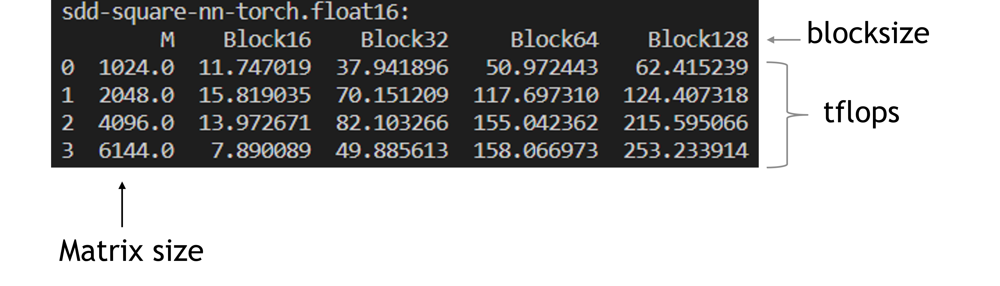

# Triton block sparse

## Getting started
Setup environment:
```
docker build -t test_triton .
nvidia-docker run -it --rm test_triton bash
```


## Benchmark triton block sparse matmul
```
git clone ssh://git@gitlab-master.nvidia.com:12051/jaywan/study-sparse-attention.git
cd study-sparse-attention
python test_block_sdd_dsd.py
```

Results looks like:   
    


Triton use TF32 by deault.    
Change line [#67](https://github.com/openai/triton/blob/d345ddf83782b9abd04399ec3ae63fad6a486dd7/python/triton/ops/blocksparse/matmul.py#L67) and [#186](https://github.com/openai/triton/blob/d345ddf83782b9abd04399ec3ae63fad6a486dd7/python/triton/ops/blocksparse/matmul.py#L186) in `triton/ops/blocksparse/matmul.py` to disable TF32 as following:    
`acc += tl.dot(a, b)`  -->  `acc += tl.dot(a, b, allow_tf32=False)`   
Note: For precompiled triton, this file locates here: `/opt/conda/lib/python3.8/site-packages/triton/ops/blocksparse/matmul.py`   


## Results
### GPU info
Test on single V100 32GB PCIE.    
Peak perf:   
| precision | TFLOPS |
| ------ | ------ |
| FP32 | 14 |
| FP16 | 112 |

### 75% sparsity
SDDMM + FP16 results:
| M     | block 16 | block 32 | block 64 | block 128 | 
| ----- | -------- | -------- | -------- | --------- |
|   512 | 4.09 |  4.36 |  4.09 |  2.62|
|  1024 | 7.48 | 14.56 | 18.72 | 12.48|
|  2048 | 8.54 | 20.76 | 46.09 | 53.09|
|  4096 | 7.03 | 20.34 | 55.50 | 72.47|
|  6144 | 3.74 | 18.77 | 53.03 | 78.67|

SDDMM + FP32 results: 
| M     | block 16 | block 32 | block 64 | block 128 | 
| ----- | -------- | -------- | -------- | --------- |
|   512 | 1.33 |  2.18 |  0.93 |  0.20|
|  1024 | 1.83 |  2.99 |  3.82 |  0.89|
|  2048 | 1.83 |  3.75 |  5.60 |  3.34|
|  4096 | 1.88 |  3.75 |  7.06 |  3.83|
|  6144 | 1.89 |  3.82 |  7.44 |  4.00|

### 90% sparsity
SDDMM + FP16 results: 
| M     | block 16 | block 32 | block 64 | block 128 | 
| ----- | -------- | -------- | -------- | --------- |
|  512 | 1.86     |   1.70     |   1.44   |    0.65 |
| 1024 | 5.81     |   7.73     |   7.31   |    4.79 |
| 2048 | 8.22     |  18.20     |  27.85   |   21.00 |
| 4096 | 7.31     |  21.16     |  48.55   |   54.56 |
| 6144 | 3.92     |  19.96     |  52.27   |   62.11 |

SDDMM + FP32 results: 
| M     | block 16 | block 32 | block 64 | block 128 | 
| ----- | -------- | -------- | -------- | --------- |
|   512 | 0.96     | 0.85     | 0.34     | 0.05    |
|  1024 | 1.55     | 2.29     | 1.52     | 0.32    |
|  2048 | 1.84     | 3.25     | 4.69     | 1.34    |
|  4096 | 1.85     | 3.78     | 6.58     | 3.20    |
|  6144 | 1.88     | 3.80     | 7.38     | 3.72    |

### 95% sparsity
SDDMM + FP16 results: 
| M     | block 16 | block 32 | block 64 | block 128 | 
| ----- | -------- | -------- | -------- | --------- |
|  512   | 0.93     |  0.81     | 0.76     |  0.00     |
| 1024   | 4.17     |  4.17     | 3.51     |  2.34     |
| 2048   | 7.35     | 14.92     |14.40     | 10.08     |
| 4096   | 7.35     | 20.51     |40.26     | 40.76     |
| 6144   | 4.87     | 19.24     |37.87     | 57.24     |

SDDMM + FP32 results: 
| M     | block 16 | block 32 | block 64 | block 128 | 
| ----- | -------- | -------- | -------- | --------- |
|  512   | 0.76     | 0.40      |0.173070  | 0.00      |
| 1024   | 1.47     | 1.83      |0.733612  | 0.15      |
| 2048   | 1.74     | 3.20      |3.117851  | 0.64      |
| 4096   | 1.85     | 3.59      |6.489973  | 2.64      |
| 6144   | 1.86     | 3.72      |7.343267  | 3.27      |

# Vector Sparse

## Setup environment
Please follow [https://github.com/apuaaChen/vectorSparse](https://github.com/apuaaChen/vectorSparse).

## Test SDDMM/SpMM
The authors provide scripts to produce all the results in their paper.    
I currently don't have time to complete a script to automatically compare vector sparse with Triton's block sparse.    
So I manually change the code and get a few useful results.

Here is the example:    
Firstly, choose a 95%-sparsity matrix from dataset (`dlmc/rn50/magnitude_pruning/0.95/*.smtx`).    
```
head -n 1 <workspace>/dlmc/rn50/magnitude_pruning/0.95/bottleneck_1_block_group1_1_1.smtx
> 64, 256, 819
```
The first line of the file shows M=64, N=256, nnz=819.

Then replace the [job_launcher.py#L53](https://github.com/apuaaChen/vectorSparse/blob/29f9c129927207c8553a07c43396caee480a55be/job_launcher.py#L53) with:
```python
benchmark = '<workspace>/dlmc/rn50/magnitude_pruning/0.95/bottleneck_1_block_group1_1_1.smtx'
```
Then use `cudaEvent` to measure the flops at [sddmm_benchmark.cpp#L257](https://github.com/apuaaChen/vectorSparse/blob/29f9c129927207c8553a07c43396caee480a55be/sddmm_benchmark.cpp#L257):
```cpp
            int repeat = 1000;
            cudaEventRecord(start);
            for(int i=0; i<repeat; i++)
                sddmm::wmmaSddmm(m_vec, k, n, ...);
            cudaEventRecord(stop);
            cudaEventSynchronize(stop);
            float ms = 0.0;
            cudaEventElapsedTime(&ms, start, stop);
            // manually set nnz = 819
            float num_flops = 2.0 * k * (819 * 8 * 1) * repeat;
            float TFLOPS = num_flops / (ms / 1e3) * 1e-12;
            std::cout << "TFLOPS: " << TFLOPS << std::endl;
```
Compile cuda code:
```shell
bash setup.sh
```
Run the test:
```shell
python3 job_launcher.py --start 0 --end 2 --dimK 256 --dimV 8 --kernel wmma --sort --job sddmm --sddmm_alg mma_arch --precision half
```
